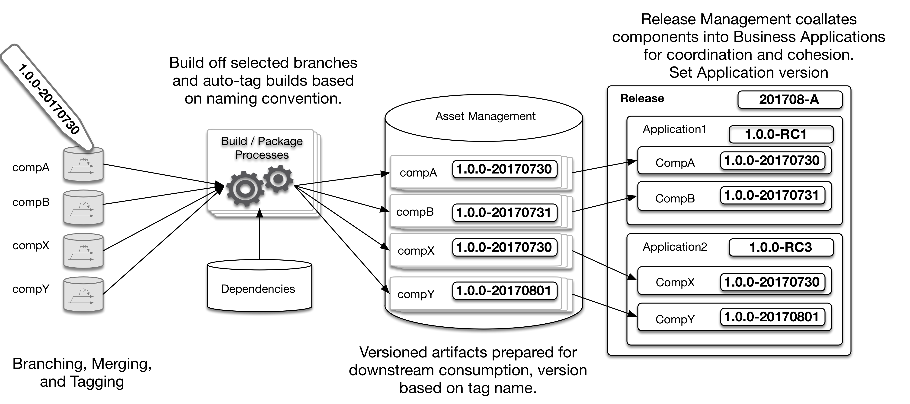

# Version Naming Standards

The overall goal is to provide a standard that can drive more consistency across the teams and management of the lifecycle of artifacts flowing through the system. By sharing a common model here more information can be implicitly conveyed by talking about specific versions rather than relying on a translation exercise from release codenames as well as differences across teams or applications. The high value proposition is how this plays in the broader view when we start talking at a business unit and organization level and we are talking about multiple applications at a time.

### Version Naming

The most common standard in naming is the Semantic Versioning model. This consists of three versions in the form:

    X.Y.Z

Where we think of them to represent different types of releases.

  * X - Major releases
  * Y - Minor releases
  * Z - Fix Releases

### Internal Version Naming

For simple alignment with a continuous integration system it is easy to extend this model to include and additional piece of unique identifier information to allow for internal tracking of pre-release builds.

    X.Y.Z-<unique id>

Common types of uniques identifiers here are a timestamp or auto-incrementing build number. For our case here, the user of a timestamp is recommended as this also helps to capture more information that is easily recognizable by humans as well.

    X.Y.Z-YYYYMMdd-HHmmSS

This provides a basis for our internal version system. The last piece of information required to complete this picture is to account for how release candidates are translated to Releases.

### Creating Versioned Artifacts

The key requirement here is that we have a continuous integration system that is capable of creating the key versioned artifacts.

  * Version Control Tags/Labels
  * Versioned Artifacts in the Artifact Management Systems

### End to End Versioning view

The goal is to provide implicit clarity of what version, where it comes from, all the way to deployment and release inventory without the need to perform any translation.
